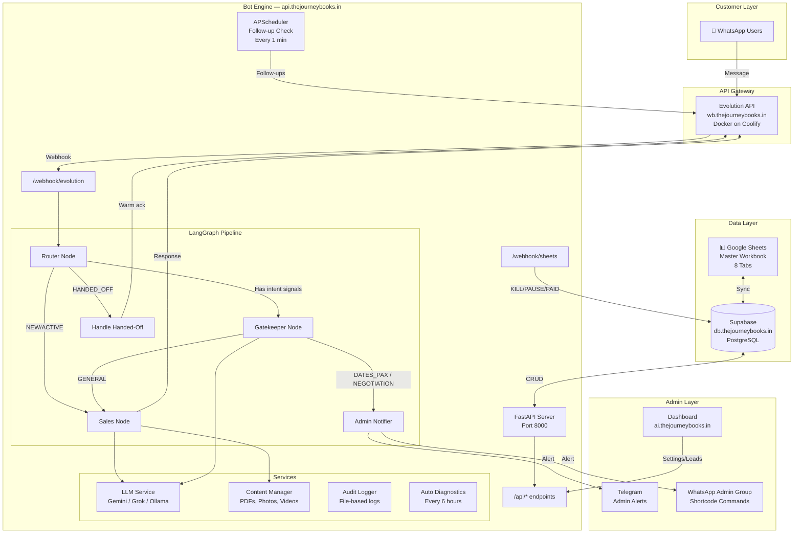

# The Journey Books — Product Requirements Document (PRD)

> **Version:** 1.0 | **Date:** 2026-03-04 | **Profile:** dev | **Status:** Active

---

## 1. Product Overview

**The Journey Books (TJB)** is an AI-powered WhatsApp-first sales system for an Indian adventure travel company. It replaces manual sales agents with a LangGraph-based conversation pipeline that handles lead intake, trip information delivery, intent classification, and warm handoff to human agents for phone call closing, also follow ups.

### Core Value Proposition
- **Zero manual responses** for trip info — 24/7 instant itinerary delivery
- **Clean handoff** — AI stops exactly when customer is ready to negotiate/book
- **Follow-up automation** — scheduled nudges to re-engage ghosting leads

---

## 2. System Architecture



### Component Map

| Component | Tech | Location | Purpose |
|-----------|------|----------|---------|
| **Bot Engine** | FastAPI + LangGraph | `app/` (28 files) | WhatsApp message processing pipeline |
| **LangGraph Nodes** | Python | `app/graph/nodes/` (7 nodes) | router, sales, gatekeeper, admin_notifier, handle_handed_off, followup, booking |
| **LLM Service** | Multi-provider | `app/services/llm.py` (584 lines) | Grok (Primary) with Ollama/Gemini/OpenAI fallback |
| **Evolution API** | Docker | `wb.thejourneybooks.in` | WhatsApp Business connector |
| **Supabase** | PostgreSQL | `db.thejourneybooks.in` | Leads, messages, trips, settings, whitelist |
| **Dashboard** | React | `ai.thejourneybooks.in` | Lead management, kill/pause switches |
| **Google Sheets** | 8-tab workbook | Google Drive | Trip inventory, booking data, accounting |
| **Content** | Static files | `content/` + `data/` | Bot instructions, trip PDFs, media |

---

## 3. Conversation Flow (LangGraph Pipeline)

```mermaid
stateDiagram-v2
    [*] --> Router: Message arrives

    Router --> Sales: NEW or ACTIVE lead
    Router --> Gatekeeper: Lead has intent signals
    Router --> HandleHandedOff: Status = HANDED_OFF
    Router --> [*]: KILLED / PAUSED / WHITELIST

    Sales --> [*]: Response sent

    Gatekeeper --> AdminNotifier: DATES_PAX or NEGOTIATION or CALL_REQUEST
    Gatekeeper --> Sales: GENERAL_QUESTION or GREETING
    Gatekeeper --> [*]: Already handled

    AdminNotifier --> [*]: Alert sent to admin group

    HandleHandedOff --> [*]: Warm acknowledgment sent
```



### Node Details

| Node | File | What it does |
|------|------|-------------|
| **Router** | `router.py` | Loads/creates lead, checks whitelist, kill/pause switches, routes by lead status |
| **Sales** | `sales.py` | LLM-powered conversation: trip info dump (text → PDF → photos → "dates?"), trip matching, general Q&A |
| **Gatekeeper** | `gatekeeper.py` | Intent classification (DATES_PAX, NEGOTIATION, CALL_REQUEST) — triggers handoff |
| **Admin Notifier** | `admin_notifier.py` | Sends alert to admin WhatsApp group + Telegram with lead summary |
| **Handle Handed-Off** | `builder.py` | LLM generates warm, context-aware reply for post-handoff messages |
| **Follow-up** | `followup.py` | Scheduled (every 1 min): checks leads needing follow-up nudges |

---

## 4. Follow-Up / Retention Loop

| Stage | Timing | Message Type |
|-------|--------|-------------|
| 0 | First message | Info dump (text + PDF + photos + "dates kab?") |
| 1 | 2-3 min after no reply | Voice-like nudge: "dates batao + group size" |
| 2 | 3-4 hours after no reply | Second ask: "sir aapki taraf se koi response nahi aaya" |
| 3 | 24 hours | Social proof: batch photo + "join us!" |
| 4 | 48 hours | Offer: "₹500 off — final call!" |
| 5 | 72 hours | Cross-sell: "If not Manali, check Jibhi or Spiti" |
| DEAD | After stage 5 | No more messages — lead marked DEAD |

---

## 5. Admin Shortcode Commands

Available in the admin WhatsApp group:

| Command | Action |
|---------|--------|
| `/whitelist <number>` | Bot ignores this number |
| `/blacklist <number>` | Kill switch ON |
| `/pause <number_or_id>` | Human takes over |
| `/unpause <number_or_id>` | Bot resumes |
| `/status <number_or_id>` | Show lead details |
| `/dead <number_or_id>` | Mark lead as DEAD |
| `/alive <number_or_id>` | Reactivate lead |
| `/trips` | List active trips |
| `/stats` | Show bot statistics |
| `/suggest <number_or_id>` | AI sales suggestion for a lead |

*Note: `<number_or_id>` can be the full phone number or the unique lead ID (e.g., `TJB-1024`).*

---

## 6. API Endpoints

| Method | Path | Purpose |
|--------|------|---------|
| POST | `/webhook/evolution` | Receive WhatsApp messages |
| POST | `/webhook/sheets` | Receive KILL/PAUSE/PAID from Sheets |
| GET | `/health` | Health check |
| GET | `/api/settings` | Get bot settings |
| POST | `/api/settings` | Update bot settings |
| GET | `/api/leads` | List all leads |
| POST | `/api/leads/{id}/kill` | Kill switch toggle |
| POST | `/api/leads/{id}/pause` | Pause toggle |
| GET | `/api/trips` | List active trips |

---

## 7. What's NOT Built Yet (Per Client Meeting)

| Feature | Priority | Notes |
|---------|----------|-------|
| ~~Invoice Generation~~ | ❌ Not in scope | Client handles billing manually |
| ~~Payment Processing~~ | ❌ Not in scope | "We are not involved in billing and invoice for now" |
| Multi-Instance Support | 🟡 Planned | 3+ WhatsApp numbers with different agent names |
| Post-Trip Thank You | ⬜ Low | Auto-send after trip date passes |
| Telegram Admin Bot | 🟡 Partial | Alerts work, full command support pending |
| CRM Admin Frontend | ✅ Built | Dashboard at `ai.thejourneybooks.in` |

---

## 8. Supabase Schema (10 Tables)

| Table | Purpose |
|-------|---------|
| `leads` | All customers — phone, `lead_ref_id` (Unique ID like TJB-1024), status, trip interest, dates, pax, kill/pause switches |
| `message_log` | Full conversation history (inbound + outbound) |
| `message_dedup` | Deduplication tracking for webhook reliability |
| `trips` | Trip catalog (12 destinations) |
| `whatsapp_instances` | Bot personalities per WhatsApp number |
| `admin_groups` | Admin group JIDs per instance |
| `bot_settings` | Dynamic settings (follow-up timings, quiet hours) |
| `whitelist` | Team phone numbers (bot ignores) |
| `trip_content` | PDFs, photos, videos linked to trips |
| `sheets_sync` | Google Sheets sync tracking |

---

## 9. Trip Inventory (12 Active)

| # | Destination | Duration | Price | State |
|---|------------|----------|-------|-------|
| 1 | Manali Sissu Kasol | 2N/3D | ₹6,499 | Himachal |
| 2 | Manali Sissu Kasol Extended | 3N/4D | ₹7,499 | Himachal |
| 3 | Jibhi Tirthan Valley | 2N/3D | ₹6,499 | Himachal |
| 4 | McLeodGanj Triund | 2N/3D | ₹6,499 | Himachal |
| 5 | Chakrata Tiger Falls | 1N/2D | ₹5,499 | Uttarakhand |
| 6 | Chopta Tungnath | 2N/3D | ₹5,999 | Uttarakhand |
| 7 | Auli Skiing | 2N/3D | ₹7,499 | Uttarakhand |
| 8 | Udaipur Mount Abu | 2N/3D | ₹6,499 | Rajasthan |
| 9 | Jaisalmer Longewala | 2N/3D | ₹7,499 | Rajasthan |
| 10 | Kashmir Premium | 6N/7D | ₹15,999 | Kashmir |
| 11 | Spiti Valley Expedition | 6N/7D | ₹15,999 | Spiti |

---

# 💰 Cost Reduction Plan — LLM Token Usage

## Current Usage Analysis (Mar 1–4, 2026)

From your screenshot:

| Metric | Value |
|--------|-------|
| **Total tokens** | 459,027 (4 days) |
| **Average/day** | 114,757 tokens |
| **Peak day** | Mar 3 — 247,417 tokens |
| **Cached prompt** | 190,468 (41.5%) |
| **Reasoning tokens** | 153,071 (33.3%) |
| **Prompt tokens** | 105,594 (23.0%) |
| **Completion tokens** | 9,894 (2.2%) |

### The Problem

**Prompt + Reasoning tokens = 56.3% of total cost** — this means the system is sending massive prompts (system instructions + conversation history + trip data) on every single message.

The Mar 3 spike (247K tokens) suggests either heavy testing or a busy lead day — but caching only covers 41% of prompts.

---

## Cost Reduction Strategies

### 🔴 HIGH IMPACT — Do These First

#### 1. Switch to Smaller Models for Classification (~60% cost reduction on intent)

Currently `llm.py` uses the same model for both classification AND reply generation.

| Task | Current | Recommended | Token Savings |
|------|---------|-------------|---------------|
| Intent Classification | Full model | `gemini-2.0-flash-lite` or `grok-2-mini` | ~70% fewer tokens |
| Trip Matching | Full model | `gemini-2.0-flash-lite` | ~70% fewer tokens |
| Reply Generation | Full model | Keep current (quality matters) | 0% |
| Handed-off Reply | Full model | `gemini-2.0-flash-lite` (simple ack) | ~50% fewer tokens |

**Implementation:** Add a `model` parameter to `get_llm()` to select model per task:
```python
# classify_intent → use cheap/fast model
llm = get_llm(deterministic=True, model="lite")  
# generate_reply → use full model
llm = get_llm(deterministic=False, model="full")
```

#### 2. Trim System Prompts (~30% prompt token reduction)

The `bot_instructions.md` (64 lines) + trip data is sent on EVERY message. Most of it is redundant after the first message in a conversation.

**Fix:**
- First message → Full system prompt + trip data
- Subsequent messages → Minimal prompt (identity + key rules only)
- Move "ABSOLUTE BLOCKS" to a structured output constraint instead of prompt text

#### 3. Limit Conversation History (~20% prompt reduction)

Currently sending up to 20 messages of history. For most intents, 5-8 messages is sufficient.

| Node | Current History | Recommended |
|------|----------------|-------------|
| Sales (first reply) | 20 | 5 |
| Sales (follow-up) | 20 | 8 |
| Gatekeeper | 20 | 5 |
| Suggestion | 20 | 10 |
| Handed-off | 10 | 3 |

### 🟡 MEDIUM IMPACT

#### 4. Cache Trip Data in Memory (eliminate redundant DB reads)

Trip data (12 trips) rarely changes — cache it for 1 hour instead of reading from Supabase on every message.

#### 5. Skip LLM for Simple Cases (~15% total call reduction)

Many messages don't need LLM at all:
- **"hi"/"hello"** → Fixed template response (no LLM call)
- **Image without caption** → Already handled (no LLM)
- **"STOP"/"UNSUBSCRIBE"** → Already handled (no LLM)
- **Price questions** → Fixed redirect template ("call pe baat karte hain")

#### 6. Use Ollama for Classification (₹0 cost)

Since Ollama is already installed locally:
- Route classification (intent + trip matching) to Ollama
- Keep Gemini/Grok only for reply generation where quality matters

### 🟢 LOW IMPACT / LONG TERM

#### 7. Implement Prompt Caching Headers

If using Gemini, enable explicit context caching for the system prompt so it doesn't count as new tokens.

#### 8. Batch Follow-up Messages

Instead of checking every 1 minute, batch follow-ups every 5 minutes to reduce scheduler overhead.

---

## Projected Savings

| Strategy | Token Reduction | Cost Impact |
|----------|----------------|-------------|
| Smaller model for classification | -40,000/day | **~35%** |
| Trim system prompts | -15,000/day | **~13%** |
| Limit history | -10,000/day | **~9%** |
| Skip LLM for simple cases | -8,000/day | **~7%** |
| Ollama for classification | -20,000/day | **~17%** (moves to ₹0) |
| **Combined (conservative)** | **-70,000/day** | **~60% reduction** |

**From ~115K tokens/day → ~45K tokens/day**

*(Note: Grok is currently the primary model. All optimizations should assume Grok pricing and token counting.)*

---

## 10. Launch Checklist — Pending Human Actions

Before the system is ready for official launch, the human team must complete these steps:

1. **Verify WhatsApp Group JID:** Run `GET /group/fetchAllGroups/{instance}` on the Evolution API and paste the actual JID for the `TJB Admin Portal 🔑` group into `context.md` and the `.env` file (`ADMIN_GROUP_ID`).
2. **Review Hardcoded Templates:** Review and approve the exact Hindi/Hinglish copy for the fixed template responses (for "hi/hello" and standard price pushback) that will bypass the LLM to save tokens.
3. **Database Migration for Unique IDs:** Apply the database migration to add `lead_ref_id` (e.g., TJB-1001) to the `leads` table and ensure the FastAPI backend generates this sequentially for new leads.
4. **Update Admin Shortcodes:** Verify the FastAPI admin command handler correctly looks up leads by BOTH phone number and `lead_ref_id`.
5. **Set Up Default Grok Tokens:** Ensure Grok API keys are correctly set in the production environment and sufficient credits/limits are in place.
6. **End-to-End Test (Live Number):** Have 3 team members text the live WhatsApp number simultaneously to verify the new looping/handoff rules (max 2-4 locations, no repetitive looping) work seamlessly in production.

---

## Implementation Priority

| # | Action | Effort | Impact |
|---|--------|--------|--------|
| 1 | Split `get_llm()` into lite/full models | 1 hour | 🔴 High |
| 2 | Add template responses for "hi", price questions | 30 min | 🟡 Medium |
| 3 | Reduce history limits per node | 15 min | 🟡 Medium |
| 4 | Trim system prompt for follow-up messages | 1 hour | 🟡 Medium |
| 5 | Route classification to Ollama | 2 hours | 🟢 High (₹0 cost) |
| 6 | Cache trip data in memory | 30 min | 🟢 Low |

---

*Generated from codebase analysis + client meeting notes + token usage data.*
