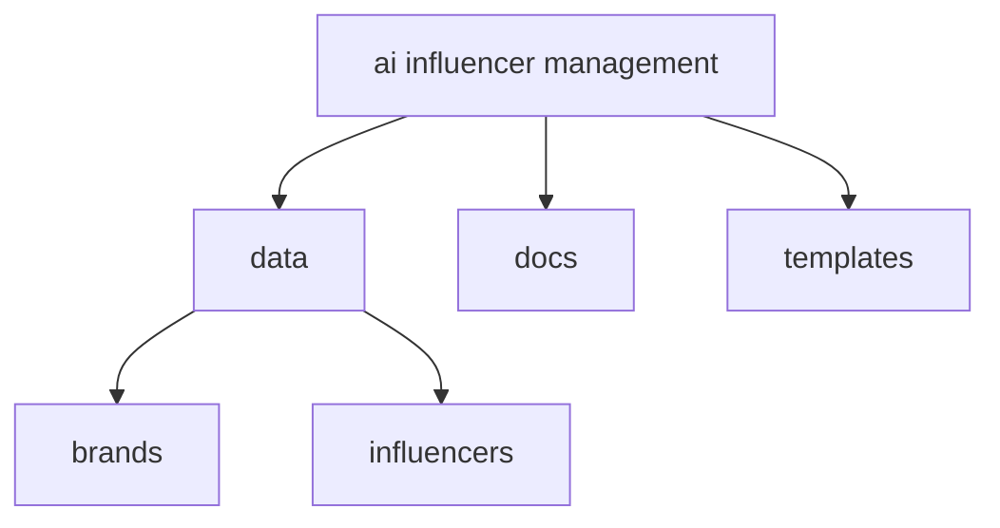

# Architecture Map

```mermaid
graph TD
  root["ai influencer management"]
  data["data"]
  data_brands["brands"]
  data_influencers["influencers"]
  docs["docs"]
  templates["templates"]
  root --> data
  data --> data_brands
  data --> data_influencers
  root --> docs
  root --> templates
  click root "file:///Users/arindamray/Library/CloudStorage/GoogleDrive-arindamroy.868@gmail.com/My Drive/ai influencer management" "Open ai influencer management"
  click data "file:///Users/arindamray/Library/CloudStorage/GoogleDrive-arindamroy.868@gmail.com/My Drive/ai influencer management/data" "Open data"
  click data_brands "file:///Users/arindamray/Library/CloudStorage/GoogleDrive-arindamroy.868@gmail.com/My Drive/ai influencer management/data/brands" "Open brands"
  click data_influencers "file:///Users/arindamray/Library/CloudStorage/GoogleDrive-arindamroy.868@gmail.com/My Drive/ai influencer management/data/influencers" "Open influencers"
  click docs "file:///Users/arindamray/Library/CloudStorage/GoogleDrive-arindamroy.868@gmail.com/My Drive/ai influencer management/docs" "Open docs"
  click templates "file:///Users/arindamray/Library/CloudStorage/GoogleDrive-arindamroy.868@gmail.com/My Drive/ai influencer management/templates" "Open templates"
```
