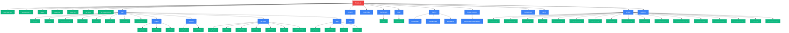

# Map — travel_ai

```mermaid
graph TD
    classDef server fill:#ef4444,stroke:#b91c1c,color:#fff,font-weight:bold
    classDef service fill:#3b82f6,stroke:#2563eb,color:#fff
    classDef node_file fill:#10b981,stroke:#059669,color:#fff,font-size:10px
    n0["travel_ai"]:::server
    n1["inspect_kuma_db.py"]:::node_file
    n2["reset_kuma_users.py"]:::node_file
    n3["rewrite.py"]:::node_file
    n4["scenario_a.py"]:::node_file
    n5["scenario_b.py"]:::node_file
    n6["test_flows.py"]:::node_file
    n7["test_supabase_async.py"]:::node_file
    n8["app/"]:::service
    n9["__init__.py"]:::node_file
    n10["config.py"]:::node_file
    n11["generate_scenarios.py"]:::node_file
    n12["live_e2e.py"]:::node_file
    n13["main.py"]:::node_file
    n14["run_e2e.py"]:::node_file
    n15["run_tests.py"]:::node_file
    n16["start_user_test.py"]:::node_file
    n17["graph/"]:::service
    n18["__init__.py"]:::node_file
    n19["builder.py"]:::node_file
    n20["state.py"]:::node_file
    n21["models/"]:::service
    n22["__init__.py"]:::node_file
    n23["schemas.py"]:::node_file
    n24["services/"]:::service
    n25["__init__.py"]:::node_file
    n26["audit.py"]:::node_file
    n27["auto_tester.py"]:::node_file
    n28["content.py"]:::node_file
    n29["evolution.py"]:::node_file
    n30["llm.py"]:::node_file
    n31["supabase_client.py"]:::node_file
    n32["utils/"]:::service
    n33["__init__.py"]:::node_file
    n34["guardrails.py"]:::node_file
    n35["text.py"]:::node_file
    n36["timing.py"]:::node_file
    n37["content/"]:::service
    n38["trips/"]:::service
    n39["credentials/"]:::service
    n40["dashboard/"]:::service
    n41["app.js"]:::node_file
    n42["data/"]:::service
    n43["sync_csv.py"]:::node_file
    n44["deploy/"]:::service
    n45["bot-engine/"]:::service
    n46["evolution-api/"]:::service
    n47["supabase/"]:::service
    n48["design-system/"]:::service
    n49["the-journey-books-admin/"]:::service
    n50["humaninput/"]:::service
    n51["nginx/"]:::service
    n52["scripts/"]:::service
    n53["check_status.py"]:::node_file
    n54["check_supabase.py"]:::node_file
    n55["debug_trips.py"]:::node_file
    n56["get_qr.py"]:::node_file
    n57["guardian_runner.py"]:::node_file
    n58["inspect_constraints.py"]:::node_file
    n59["inspect_schema.py"]:::node_file
    n60["seed_data.py"]:::node_file
    n61["seed_supabase.py"]:::node_file
    n62["seed_trips.py"]:::node_file
    n63["send_qr_to_admin.py"]:::node_file
    n64["sheets_supabase_sync.py"]:::node_file
    n65["simulate_booking.py"]:::node_file
    n66["simulate_scenarios.py"]:::node_file
    n67["simulate_webhook.py"]:::node_file
    n68["test_media.py"]:::node_file
    n69["update_db_schema.py"]:::node_file
    n70["website/"]:::service
    n0 --> n1
    n0 --> n2
    n0 --> n3
    n0 --> n4
    n0 --> n5
    n0 --> n6
    n0 --> n7
    n0 --> n8
    n8 --> n9
    n8 --> n10
    n8 --> n11
    n8 --> n12
    n8 --> n13
    n8 --> n14
    n8 --> n15
    n8 --> n16
    n8 --> n17
    n17 --> n18
    n17 --> n19
    n17 --> n20
    n8 --> n21
    n21 --> n22
    n21 --> n23
    n8 --> n24
    n24 --> n25
    n24 --> n26
    n24 --> n27
    n24 --> n28
    n24 --> n29
    n24 --> n30
    n24 --> n31
    n8 --> n32
    n32 --> n33
    n32 --> n34
    n32 --> n35
    n32 --> n36
    n0 --> n37
    n37 --> n38
    n0 --> n39
    n0 --> n40
    n40 --> n41
    n0 --> n42
    n42 --> n43
    n0 --> n44
    n44 --> n45
    n44 --> n46
    n44 --> n47
    n0 --> n48
    n48 --> n49
    n0 --> n50
    n0 --> n51
    n0 --> n52
    n52 --> n53
    n52 --> n54
    n52 --> n55
    n52 --> n56
    n52 --> n57
    n52 --> n58
    n52 --> n59
    n52 --> n60
    n52 --> n61
    n52 --> n62
    n52 --> n63
    n52 --> n64
    n52 --> n65
    n52 --> n66
    n52 --> n67
    n52 --> n68
    n52 --> n69
    n0 --> n70
```
